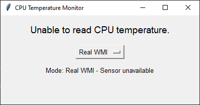
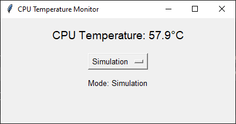

# Windows CPU Temperature Monitor

Windows CPU temperature monitoring application built with Python.

## Overview

This project provides a simple graphical interface for monitoring CPU temperature on Windows systems.

The application supports both real WMI monitoring and a simulation mode for testing the interface when CPU temperature sensors are unavailable.

## Features

* CPU temperature monitoring
* Real WMI mode
* Simulation mode
* Graphical interface (Tkinter)
* Automatic refresh every 2 seconds
* WMI integration
* Basic error handling

## Technologies

* Python 3
* Tkinter
* WMI

## Requirements

```bash
pip install WMI
```

## Run

```bash
python windows-cpu-temp-monitor.py
```

## Screenshots

### WMI Mode



### Simulation Mode



## Future Improvements

* Real CPU temperature monitoring using Libre Hardware Monitor
* Extended hardware monitoring

## Author

Jakub G.
